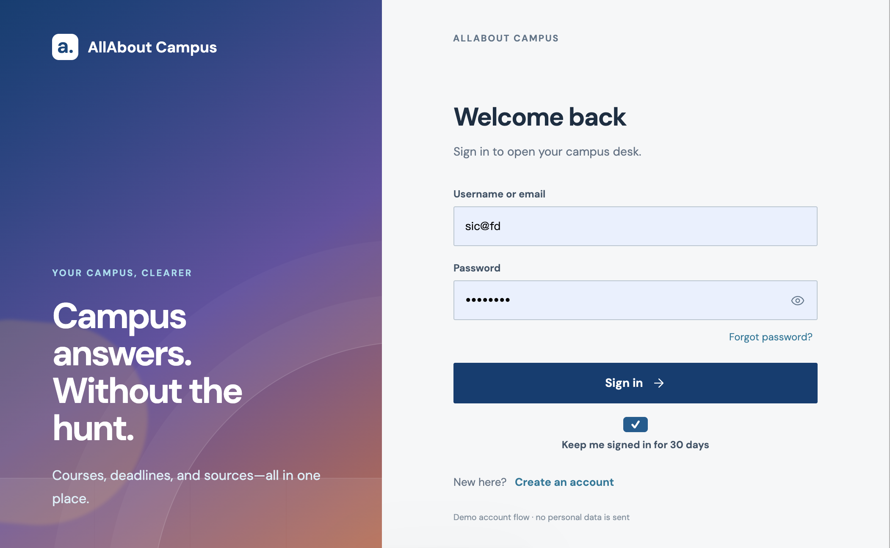
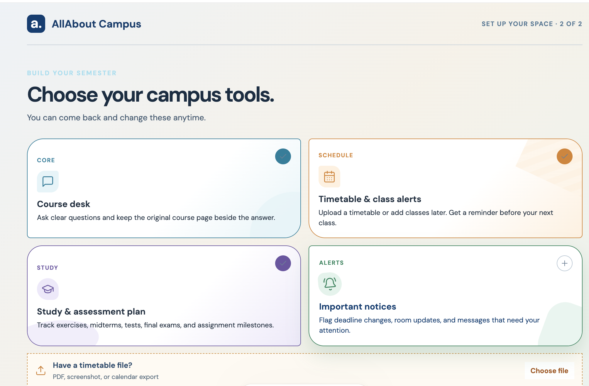

# AllAbout Campus

**A campus web agent that finds the answer and shows the evidence.**

AllAbout Campus helps students ask practical course questions—deadlines, requirements, events, exam dates—while Steel browses the relevant pages beside the conversation. The answer stays connected to its sources, so students can see what was checked and what still needs a login.

Built by Team Chill for the Battle of Schools Hackathon.

## Interface preview

### Sign in



### Choose your campus tools



### Course Desk and Steel Live Browser


## What it does

- **Course Desk** — ask a campus question and receive a cited answer.
- **Steel live browser** — watch allowlisted pages open in a read-only Steel session.
- **Coverage receipt** — see which sites were readable, login-walled, or skipped.
- **History** — reopen prior questions from this browser (does not start a new Steel session).
- **Campus tools setup** — choose Course Desk, timetable alerts, study planning, and notices.
- **Steel keychain** — save portal usernames/passwords; they are encrypted on the server and used only for exact login hosts.
- **30-day sign-in option** — keep the local demo account session on this browser.

## Product flow

```text
Sign in → choose campus tools → Course Desk
                                 ├─ Ask a course or event question
                                 ├─ Watch Steel review source pages
                                 ├─ Read cited answer and evidence
                                 ├─ Reopen prior work from History
                                 └─ Manage website accounts with Steel keychain
```

## Tech stack

- React + Vite frontend (`apps/web`)
- Fastify orchestrator (`apps/server`)
- Steel SDK + Playwright (`packages/browser`)
- Evidence extraction (`packages/evidence`)
- Shared Zod contracts (`packages/contracts`)
- OpenAI planner (`gpt-5-mini` when configured)

## Run locally

Requirements: Node.js 20+, npm, and pnpm (frontend).

Copy `.env.example` to `.env` and fill `OPENAI_API_KEY`, `OPENAI_MODEL`, and `STEEL_API_KEY`. The credential vault key is created automatically under `.data/` if omitted.

```bash
git clone https://github.com/Team-Chill-2026-9-12-Hackathon-Team/All-About.git
cd All-About
npm install

# terminal 1
npm run start --workspace @allabout/server

# terminal 2
cd apps/web
pnpm install
pnpm dev
```

Open the address Vite prints, usually `http://127.0.0.1:5173`. The web app proxies `/api` to `http://127.0.0.1:3001`.

## Demo notes

- Public calendar/event pages run as `LIVE_WEB`.
- DEMO101 uses local fixtures (`LIVE_FIXTURE`) and is labeled as such.
- The 30-day sign-in preference is stored in this browser only.
- Keychain passwords are encrypted on the server; they are never sent to the language model.
- Quercus/Piazza still need a saved keychain account, and UTORMFA cannot be completed automatically.

## Team

Team Chill — Battle of Schools Hackathon 2026
