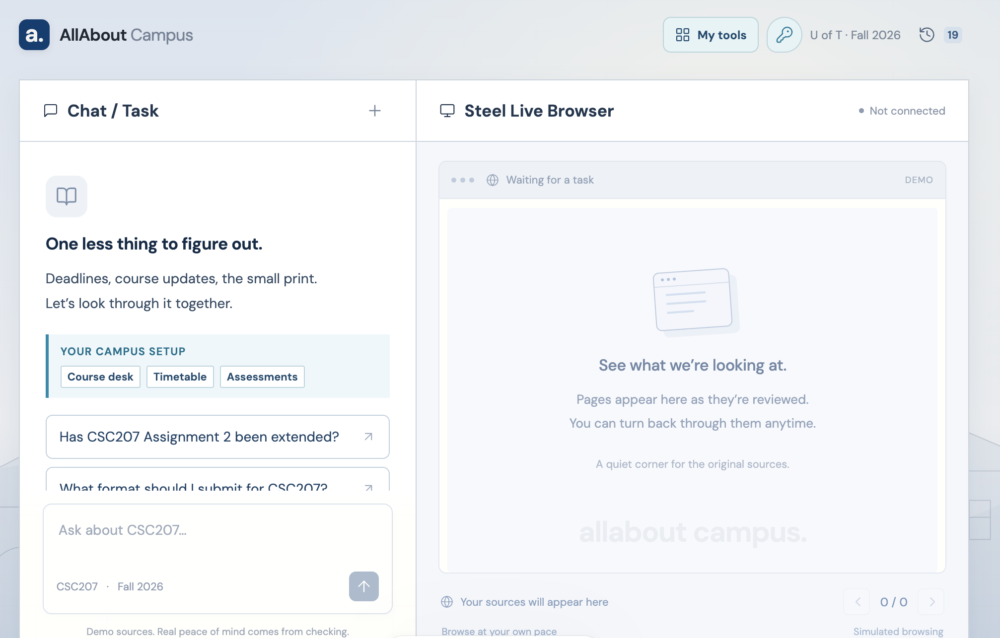

# AllAbout Campus

**A campus web agent that finds the answer and shows the evidence.**

AllAbout Campus helps students ask practical course questions—deadlines, requirements, events, exam dates—while Steel browses the relevant pages beside the conversation. The answer stays connected to its sources, so students can see what was checked and what still needs a login.

Built by Team Chill for the Battle of Schools Hackathon.

## Interface preview

### Course Desk and Steel Live Browser



## What it does

- **Course Desk** — ask a campus question and receive a cited answer.
- **Steel live browser** — watch allowlisted pages open in a read-only Steel session.
- **Coverage receipt** — see which sites were readable, login-walled, or skipped.
- **History** — reopen prior questions from this browser (does not start a new Steel session).
- **Steel keychain** — save portal usernames/passwords; they are encrypted on the server and used only for exact login hosts.

## Research and answer accuracy

Public questions use OpenAI web search to discover up to three relevant pages across the web, including community forums, before Steel reads their content. Private course materials still use the configured Quercus/ACORN adapters. Live answers are extracted against the original question, course and term, and every accepted quote must exist in the captured text. Community reports are labeled separately from university evidence. A source-backed answer is not a guarantee that every detail is correct; missing or ambiguous evidence is reported explicitly.

Live research requires an OpenAI model with web search support, API credit, and Steel access. API failures stop the run instead of silently substituting a fixed keyword answer. Labeled fixture demos remain deterministic and do not represent live research. Quercus PDF syllabi are read from the authenticated file download; scanned PDFs without a text layer still require OCR.

## Product flow

```text
Course Desk
├─ Ask a course or event question
├─ Watch Steel review source pages
├─ Read cited answer and evidence
├─ Reopen prior work from History
└─ Manage website accounts with Steel keychain
```

## Tech stack

- React + Vite frontend (`apps/web`)
- Fastify orchestrator (`apps/server`)
- Steel SDK + Playwright (`packages/browser`)
- Evidence extraction (`packages/evidence`)
- Shared Zod contracts (`packages/contracts`)
- OpenAI web-search planner and grounded answer extraction (`gpt-4.1-mini` by default)

## Run locally

Requirements: Node.js 20+ and npm.

Copy `.env.example` to `.env` and fill `OPENAI_API_KEY`, `OPENAI_MODEL`, and `STEEL_API_KEY`. The credential vault key is created automatically under `.data/` if omitted.

```bash
git clone https://github.com/Team-Chill-2026-9-12-Hackathon-Team/All-About.git
cd All-About
npm install

# install the separately packaged frontend once
npm --prefix apps/web install

# start the backend and frontend together
npm run dev
```

Open `http://127.0.0.1:5174`. The port is fixed and strict so a second Vite process cannot silently move the app to another address. The web app proxies `/api` to `http://127.0.0.1:3001`.

Verify both the backend and the frontend proxy before a demo:

```bash
npm run check:local
npm run demo:preflight
```

## Demo notes

- Public calendar/event pages run as `LIVE_WEB`.
- DEMO101 uses a real Steel session to browse public, explicitly fictional pages (`LIVE_FIXTURE`).
- If those network fixtures are unavailable, the server falls back to bundled fictional data and changes the mode to `LOCAL_FIXTURE`.
- Keychain passwords are encrypted on the server; they are never sent to the language model.
- Quercus/Piazza still need a saved keychain account, and UTORMFA cannot be completed automatically.

## Team

Team Chill — Battle of Schools Hackathon 2026
